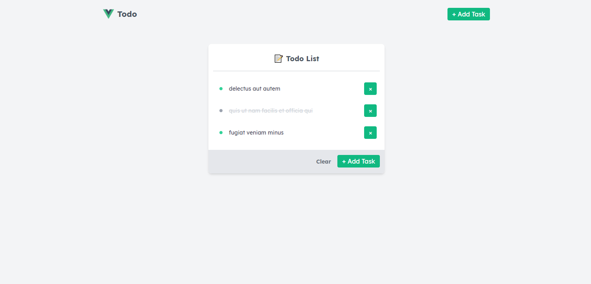

# Vue Todo

Trying vuejs for first time. This is simple todo list application built with vuejs and tailwindcss.

## Preview

## Project setup and installation

- `yarn install` - Install dependencies
- `yarn serve` - Compiles and hot-reloads for development
- `yarn build` - Compiles and minifies for production
- `yarn lint` - Lints and fixes files
